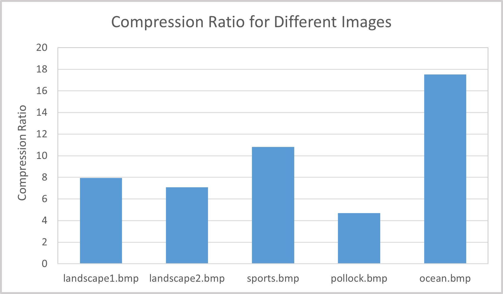

# Final Project - Image Compression

## Overview

## Lossless image compression

The testings of lossless image compression uses an implemented compressing algorithm based on Huffman Endcoding. more specific details are as following:

1. Read in the BMP file in byte, keep monitoring the frequency of each btye. Since we check the occurance of bytes, the frequency table woule be limited to at most 256 elements.

2. Using the obtained frequency table, construct a huffman tree. A piority queue is used to speed up the process. Then, for each different byte value, a unnique code is generated, the more frequently the value appears in the original file, the shorter the code will be. 

3. Generate a header for the huffman tree so that when decompressing, the computer can reconstruct the huffman tree.

4. Write the length of the header, and the header to the output file. Replace each byte with its corresponding huffman code, and write to the output file.

### Decompression
In the generated file, the first two bytes specify the length of the header stream. Then, the next that number of bits would be read and reconstruct the huffman tree. The rest of the parts would be read sequentially and along with the huffman tree, reconstruct the original file.

* This part is still under developing, but I checked a smaller file manually, and the compressed file is correct by byte.

### Results
The huffman encoding is very dependent on the image, images with dominent colors have a higher compression ratio. The following graph shows the result on each testing graph.

  

There are also methods where SIMD can be used to accelerate the process. Generally, using SIMD can speed up the process by about 50%.

  

## Lossy Image Compression

The lossy compression was based on JPEG compression. The steps used here for compressing an uncompressed .bmp image are:

1. Convert RGB to YCbCr (illuminance Y and 2 color channels Cb/Cr). The color channels can be compressed more because the human eye is more sensitive to illuminance than color.

2. Perform a DCT (discrete cosine transform) on each 8x8 block of pixels in the image. Each element in the DCT output will be quantized by a different amount, with higher frequencies being quantized more since higher frequencies are less necessary for the overall image. This results in a lot of the high frequency numbers being 0 which makes the data more compressible by subsequent run length coding. 

3. Zero run length coding. This stores a string of data as a value and the number of zeros that come before that value. This has good compression for long strings of zeros (which we have a lot of in the higher frequencies of the DCT output). 
Note that actual JPEGs compress the DC term at [0][0] differently since it's typically large. JPEGs store the *difference* between subsequent blocks' DC terms, since they are typically quite similar, but here I just included it in the RLC for simplicity.

A full JPEG implementation would then do a specific type of Huffman coding after the zero-length coding. We implemented Huffman coding in the lossless compression section in a slightly different way than JPEG needs it done, so our lossy compression stops at run length coding. Also not implemented here is the standard format with all sorts of headers/metadata that JPEG requires. 

To speed up compression, multithreading was used to process blocks of the image separately and SIMD instructions were used to speed up computing the DCT.

### Results

The compression ratio is the ratio of the size of the uncompressed image data to the compressed image data. The graph shows that for images with lots of high-frequency components (pollock.bmp), the compression ratio is much smaller than images without as many sharp changes (ocean.bmp).

  

Most of the compression was in the color channels Cb and Cr, since the illuminance channel (Y) can't be compressed as much without losing significant image quality.

  

The compression time was sped up significantly by increasing threads, up to about 16-24 threads where the improvement levels off. SIMD instructions also resulted in some speedup.

  

