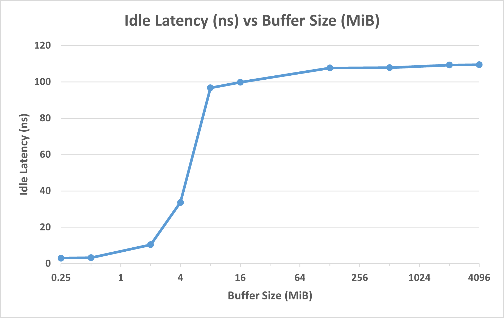
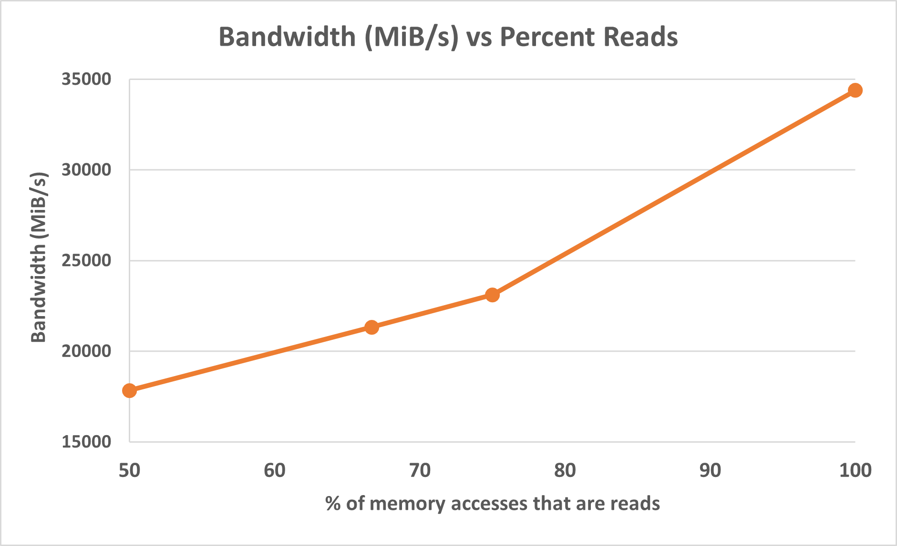
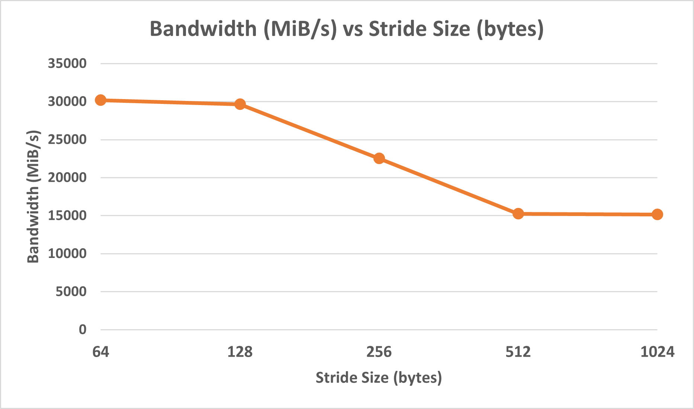
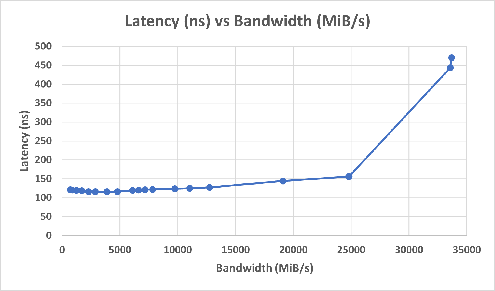
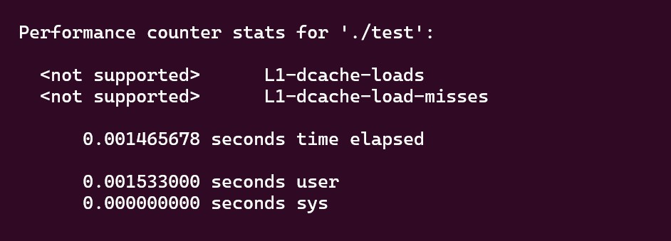
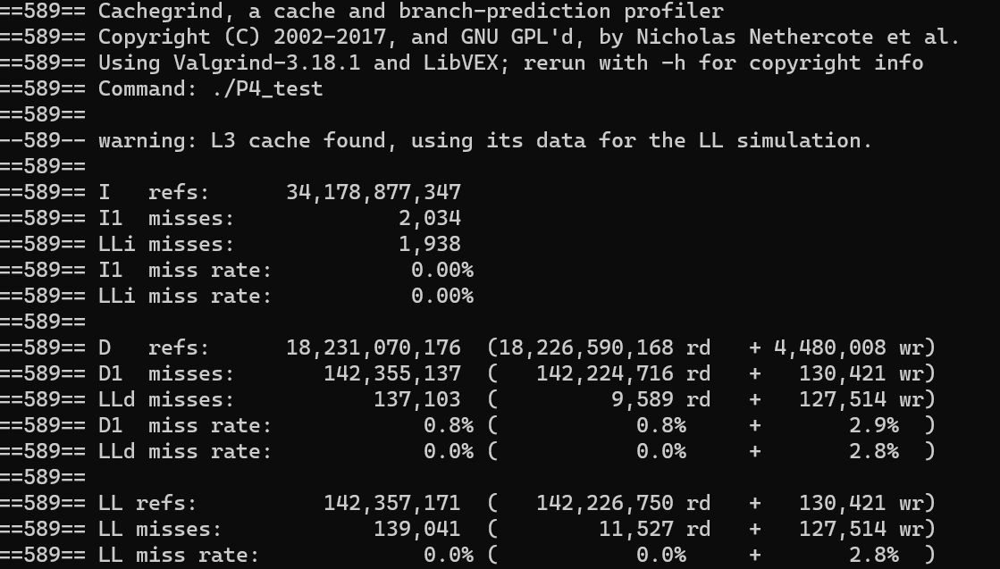
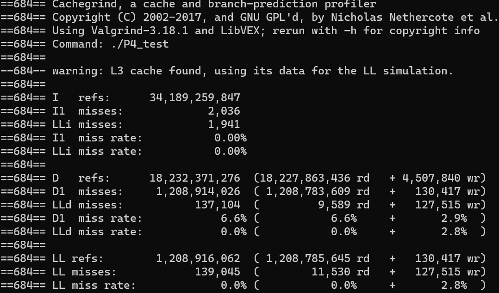
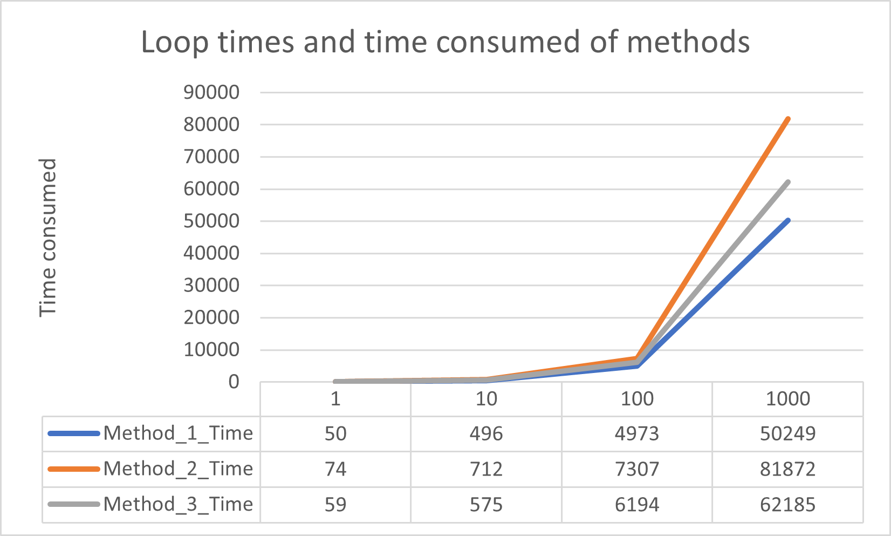
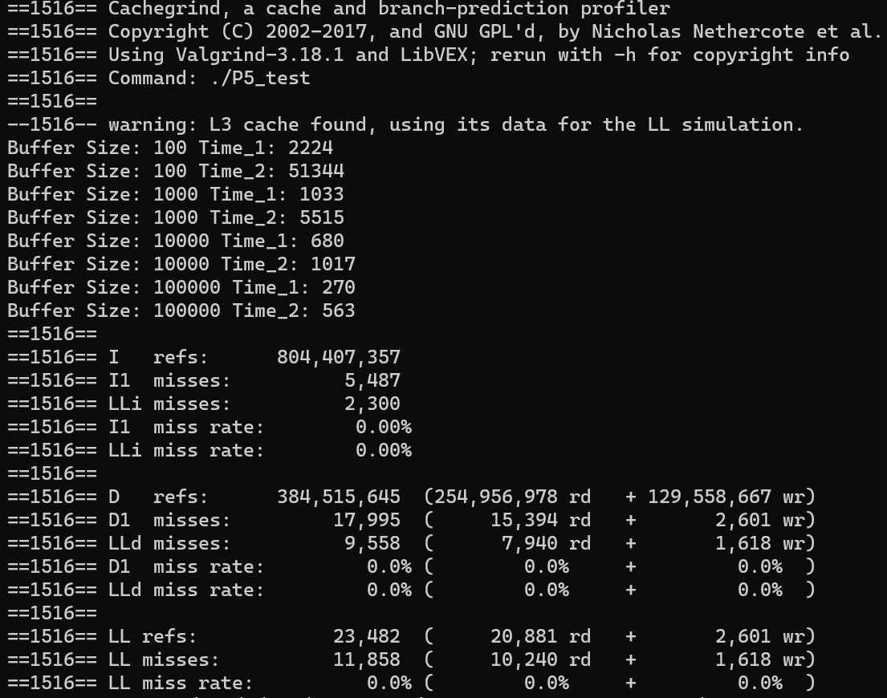

# Project 1

For questions 1-3, we used Intel Memory Latency Checker (mlc) to gather data (see mlc_tests.bat for the commands used).

### 1.) Latency with Zero Queueing Delay

To measure memory latency with no queueing delay, we used the --idle_latency option of mlc, which measures the read latency with no contention from other threads accessing memory. We can change the buffer size to indirectly change whether it's measuring cache or main memory latency. The graph shows the measured idle read latencies for various buffer sizes.  

  

The computer on which we gathered this data has 8MB of L3 cache, 3MB of L2 and 384 KB of L1 cache. Latency begins to fall at around 4-8MB buffer size as the buffer becomes smaller than the cache. At the smallest buffer size of 0.25MiB, the entire buffer can fit in L1 cache so we can assume that this latency is the cache latency. Similarly, the latency at large buffer sizes is approximately the latency of main memory because only a very small percentage of the memory accesses are able to be from cache.

Therefore, L1 cache read latency is about 3ns (measured with a 0.25MiB buffer) and main memory read latency is about 109.4ns (measured with a 4096MiB buffer).

TODO: estimate write latency 

### 2.) Maximum Bandwidth

The maximum bandwidth was measured with the --max_bandwidth option of mlc which measures max bandwidth with different ratios of reads/writes (1:1, 2:1, 3:1, and all reads). The bandwidth consistently decreases with a greater proportion of writes, indicating that writes are slower than reads.

TODO: why is writing slower?

  

The maximum bandwidth was also measured with different data access granularities, which was adjusted with the -l stride size option. This data was gathered using all reads. The graph shows that the bandwidth is highest with a 64 byte stride size and drops as stride size increases

TODO: why?

  

### 3.) Latency vs Throughput

The latency was measured under different load conditions by using the --loaded_latency option of mlc. This option generates lots of memory traffic with different threads and then measures read latency.

We found that the latency increases with the bandwidth. Below 10,000MiB/s, the latency remains approximately constant at around 115-120ns, which is very close to the idle latency of 109ns (measured in part 1). Between 10,000-25,000MiB/s, the latency increases only very slightly. However, as we approach maximum memory bandwidth, the latency increases sharply. The maximum latency was about 470ns at 33,681MiB/s.

This aligns with what the queueing theory predicts. With higher bandwidths the memory server is almost never idle, so the server utilization is high. However, this increases the queue length, which results in a higher latency as each memory access request needs to wait in that longer queue.

  

### 4.)
For Q4, we tried a couple of ways to obtain the cache miss and miss ratio on Windows system. The linux perf command can be used on WSL, but all hardware events are not supported. Therefore, we used valgrind to simulate a cache result.

  

We designed our code to loop through a 2000 * 1024 2D array in three methods of different miss ratio. Then, we record the time taken to run the program. The script can be found in C++/TestScript_Q4.cpp.

Below are the test results of each method, the key parameter is the "D1", which represents the L1 data cache.
Method 1 access the array in Row-Col order, in theory it should have a low miss ratio:

  

Method 2 access the array in Col-Row order, in theory it should have a higher miss ratio:

  

Method 3 combines the previous two methods.

  

Below is the performance of each method of executing the methods repeatedly, time is in milliseconds:

  

From the graph, it can be observed that method 1 has nearly double the performance of method 2. The reason for that is because array can be read each "row" continuously, but reading data from another row, array[0][0] -> array[1][0], for example, require reading from another address that is not sequential. This leads to more read operations and higher cache miss ratio. 

### 5.)
From the official document, we get to know that valgrind-cachegrind tools can't record TLB misses, and that WSL doesn't support any hardware events, so it can't monitor TLB misses either. Therefore, we have to find other ways to observe the influence of TLB misses.

After researching to various ways of triggering TLB misses and TLB improvement plans, we decides to control variables and test the time of reading a file using different methods.

The input file consists of around 1MB of data, and we are using two methods to read it, and the experiment is repeated with different buffer sizes.
1. Access the file sequentially.
2. Access the file every other block, i.e. if we devide the whole file into 6 parts, then the order will be 1-3-5-2-4-6.
More details can be found in TestScript_Q5.cpp. In theory, with everything else the same, reading in non-sequential order will trigger more TLB misses, which leads to more time.

Below is the time result. Valgrind is still used to check that mere cache result is as intended.

  
