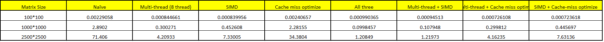

# Project 2

## Implementations

### Threading
We use the build in multi-thread library for linux to do multi-thread calculations. First, matrix 1 is split into several partial matrices by rows. For example, if there are 4 rows and we use 4 threads, then each thread will take care of one row. Multiple the partial matrix with matrix 2, and then the thread will write the result to the correct location of the final results.

Rows are distributed by calculating totalnumber of rows / number of thread, and the last thread takes the remain. We assume that in reality number of rows will be way larger than number of threads, so the last threads calculating at most threadnumber - 1 extra rows will have relatively little influence on time.

### SIMD
We used the AVX2 instruction set for this which allows for operating on 256 bits at a time (8x 32-bit floats). Now when computing a single element of the result, it can multiply 8 pairs of 2 floats at a time (or 4 pairs of 2 doubles). This is accomplished with the _mm256_fmadd_ps (or _mm256_fmadd_pd) instruction, which multiplies 8 pairs of floats and then adds the result to another 8 floats. 

### Decrease cache miss rate
During the basic implementation, we loop over the elements in each column of m2, which causes a separate memory load for each element. To avoid this, we can first take the transpose of m2 to make the columns become rows. Now when we want to loop through a column of m2, the elements are sequential in memory and we can take advantage of spatial locality. A memory load will also load nearby elements into cache so that reading subsequent elements in that row will result in a cache read rather than a memory read.

## Test Results
## Results on different data percisions and different matrix sizes
We compared the speed of running the program on double data type and foat data type. The previous is 64-bit floating point data and provides far more precision than float data type. We compared the time under different number of threads and different matrix sizes.

<p align="center">  </p>

As is shown in the graph, when matrix size is small, double datatype generally takes about the same time as float data type. As the size gets larger, double data type calculations takes more and more time. When calculating 10000x10000 matrix multiplications, it can take over 2 minutes longer using 1 thread and about 50 seconds longer using 4 threads.

Generally, a larger difference in time is found in single thread than multi threads. We assume that the reason was that it's because the matrix is split into smaller ones, and for each partial matrix, the difference is not as larger as the time for calculating the whole matrix (we can see this in results for smaller matrix multiplications as well). 

### Results of performance of various improvements
We tested all combinations of the three improvements on 3 matrix sizes: 100x100, 1000x1000 and 2500x2500. The results are as shown in the following graph:

<p align="center">  </p>

<p align="center">  </p>

As is shown, comparing to the native implementation, all methods to improve speed can improve the performance of the program to some extent.

Multi-threading using 8 threads led to the largest performance improvement (4 seconds for a 2500x2500 matrix compared to 71 seconds for the naive implementation). Using SIMD instructions was also very good (7.33 seconds with a 2500x2500 matrix). This makes sense because these methods are both able to perform some calculations in parallel.

The cache miss optimization led to the smallest performance improvement. At smaller matrix sizes (1000x1000 and below), it didn't improve performance at all. This is because with smaller matrix sizes the entire matrix can easily fit in the cache, so even the naive method will mostly read from cache. However, once the matrix gets larger than cache, this method starts to result in some improvements. For example, the cache miss optimization method completed the 2500x2500 matrix in half the time of the naive implementation.

Overall, the best performance was with all three optimizations, which is expected since it benefits from several threads, SIMD instructions, and having fewer cache misses.

## Running the code

All implementations are merged together in main.cpp which can be compiled with
```
g++ -pthread -march=native main.cpp -o main.o
```
The command line usage is:
```
./main.o matrix1_file matrix2_file use_threads use_simd use_cache_miss num_threads output_file
```
* matrix1_file = name of file containing matrix1
* matrix2_file = name of file containing matrix2 
* use_threading = use multithreading optimization (0 or 1)
* use_simd = use SIMD optimization (0 or 1)
* use_cache_miss = use restructuring of data access patterns to minimize cache miss rate (0 or 1)
* num_threads = number of threads to use (only applicable when use_threading = 1)
* output_file = name of output file

For example, to run the 4x4 test case with both 4 threads and using SIMD instructions:
```
./main.o TestData/M4x4.txt TestData/M4x4.txt 1 1 0 4 output.txt
```
