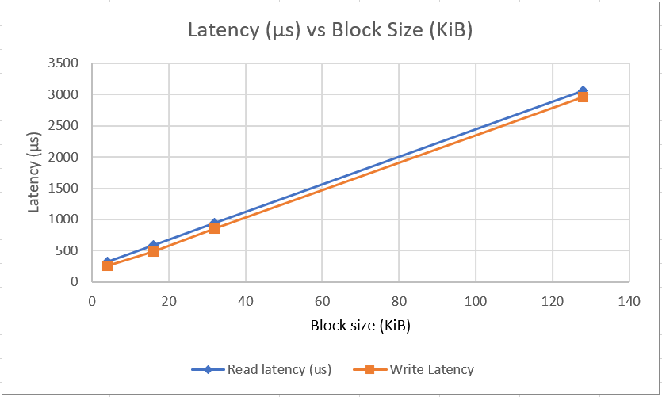
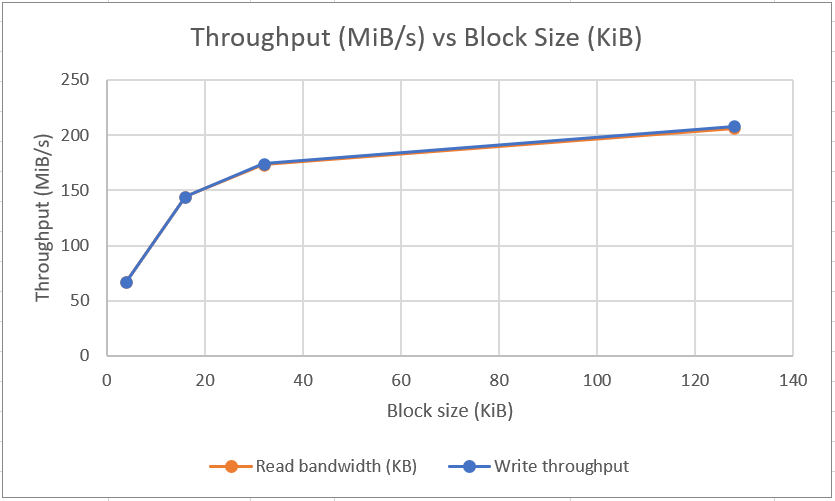
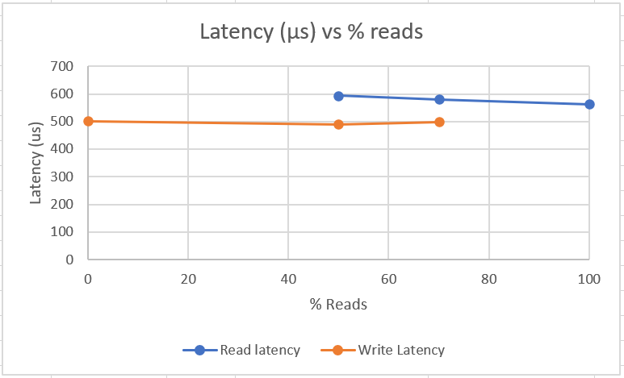
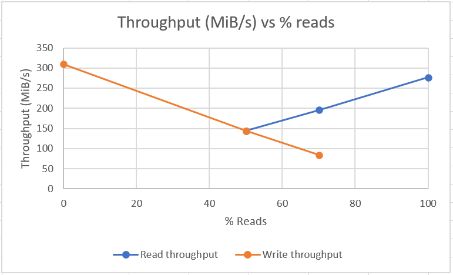
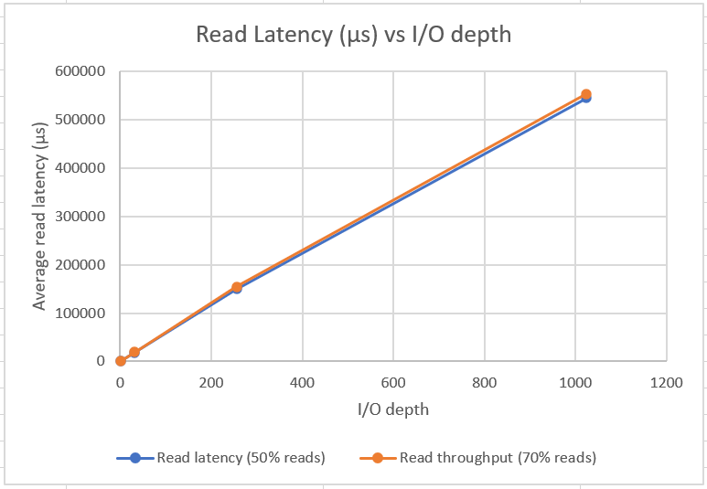
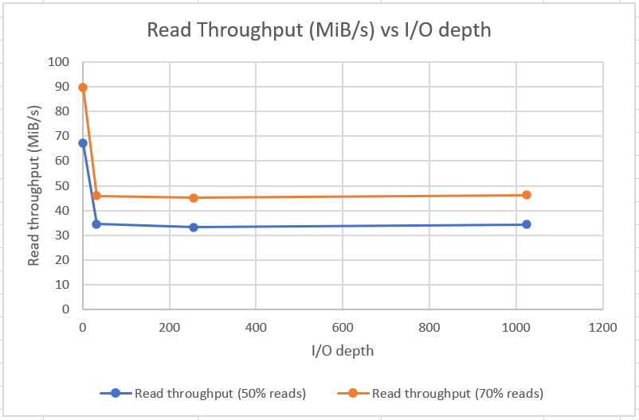

# Project 3

We tested combinations of different block sizes (4KB, 16KB, 32KB and 128KB), read-write ratios (0%, 50%, 70%, and 100% reads), and I/O depths (1, 32, 256, and 1024). For each combination, fio provides the read latency, write latency, read throughput and write throughput. All of the output data is in parsed_test_data.xls. 

## Data Access Size

We used the -bs option to change the data access size. The graphs show how latency and throughput change with data access size. These graphs have iodepth fixed at 1 and % reads fixed at 50%.

The latency increases approximately linearly with block size. The latency is measured per-I/O access so it makes sense that a larger block size takes longer to read from memory. 

  

The throughput graph shows that throughput increases with block size and eventually levels off. This shows that there is a performance improvement associated with using larger I/O accesses. This could be due to less overhead in making requests. For example, with the 4KiB block size it has to make 32 times as many read requests as it would with the 128KiB block size to read the same amount of data. 

  

## Read vs Write Intensity Ratio

Next we used the -rw and the -rwmixread options to change the percentage of memory accesses that were reads. The graphs show the throughput and latency vs percentage reads while holding block size fixed at 16KiB and iodepth fixed at 1.

The read and write latency are fairly constant compared to the percentage reads and are fairly close to each other.

  

Looking at the throughput, it looks like fio maintains a constant total throughput despite the mixture of reads and writes. This leads to a lower read throughput and a lower write throughput when the accesses are a mix between reads and writes, but overall performance was pretty constant for all cases.

  

## I/O Queue Depth

Last we used the -iodepth option with 1, 32, 256 or 1024 to see how the performance changes with different queue lengths. The graphs are for a 4KiB block size.

The latency increased with a larger I/O depth, as the queueing theory predicts. When there's a larger queue, each individual read request has to wait longer to be carried out.

  

However, the bandwidth doesn't align with what queueing theory would predict. We would expect that with a larger queue, the bandwidth would increase. However, our results show the largest bandwidth at iodepth = 1 and a fairly constant bandwidth for other iodepths.

  

## Conclusion
