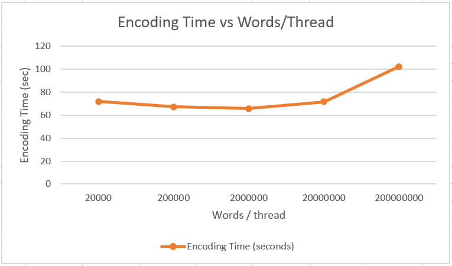
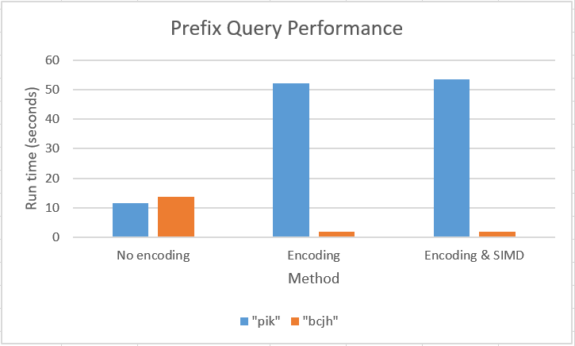

# Project 4

## Implementation

The dictionary encoding uses a hash table to store the mapping between words and an integer code. We use multi-threading to speed up the encoding by assignment each thread a chunk of the words to convert to codes and add to the dictionary.

Because the data is now all integers instead of strings, we can used SIMD instructions to compare multiple values at a time when doing the single or prefix word searching. The single word query uses the dictionary to get the code for the query word, and then it loops through the encoded column to look for this code. If SIMD instructions are turned on, it makes 4 comparisons at a time using AVX instructions. The prefix query does something similar except first it finds all words in the dictionary that begin with a certain prefix and then performs the lookup for each of those words.

## Results

### Encoding and compressing

The input file was "Column.txt" was 1GB. After both dictionary encoding, the output file is approximately the same size as the original file, and compression, the resulting file is 0.8GB, the compression ratio is about 20%.

In fact, the hash function is designed based on the features of words in the columns. After checking the contents, all words in it are less than 10 characters. Therefore, we decided to use five bits to represent a letter, and 10 characters would at most take 50 bits, which can fit into a 64-bit uint64_t integer. One benefit is for this is that we can ensure no conflicts, and words with same hash values must be the same. In the program we uses the zlib liburary for compressing the data, but if possible, we can try to first manually chop the 14 bits from each integer before compressing, which can bring the compression ratio to at least 0.22, and then do further compression.

The image shows the encoding time under different numbers of threads (more words/thread leads to fewer threads). The performance got worse if there were too many or not enough threads. Too many threads will result in more overhead as the CPU has to constantly be switching between threads. Too few threads and the benefits from splitting the work between threads will be too small.

  

### Query 
The single word query was much faster with the encoded data. This is because it's faster to compare integers than strings. Each character in a string needs to be compared individually, whereas an integer can be compared in a single instruction. The SIMD implementation showed a small improvment in addition to just doing dictionary encoding. The results from the single word query are shown in the figure below.

  

The prefix query was actually slower with the dictionary encoding. The unencoded implementation just loops through all the words and checks the first characters to see if it has the prefix. The encoded implementation first looks up the words in the hash table's keys. This makes it faster at finding the unique words with a given prefix. However, then it stil has to loop through all the values to find the indexes where these words occured in the column which ends up making it much slower than the unencoded implementation. As a result, then performance depended heavily on how many prefix matches there were (more unique, like with 'pik' made the performance much worse).

  

One alternative might be to use a tree instead of a hash table. This would be make it easier to find words with a given prefix, since they'd all be around the same location in the tree. However, when the hash table and tree were compared in the encoding step, the hash table was much faster, so the tree isn't a better solution in every situation.

