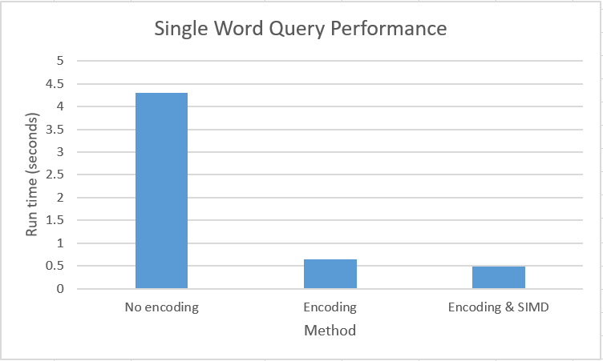

# Project 4

## Implementation

The dictionary encoding uses a hash table to store the mapping between words and an integer code. We use multi-threading to speed up the encoding by assignment each thread a chunk of the words to convert to codes and add to the dictionary.

Because the data is now all integers instead of strings, we can used SIMD instructions to compare multiple values at a time when doing the single or prefix word searching. The single word query uses the dictionary to get the code for the query word, and then it loops through the encoded column to look for this code. If SIMD instructions are turned on, it makes 4 comparisons at a time using AVX instructions. The prefix query does something similar except first it finds all words in the dictionary that begin with a certain prefix and then performs the lookup for each of those words.

## Results

### Encoding 

The input file was "Column.txt" was 1GB. After both dictionary coding and compression, the resulting file is 0.8GB

TODO: encoding performance under different number of threads

### Query 
The single word query was much faster with the encoded data. This is because it's faster to compare integers than strings. Each character in a string needs to be compared individually, whereas an integer can be compared in a single instruction. The SIMD implementation showed a small improvment in addition to just doing dictionary encoding. The results from the single word query are shown in the figure below.

  

TODO: prefix query

